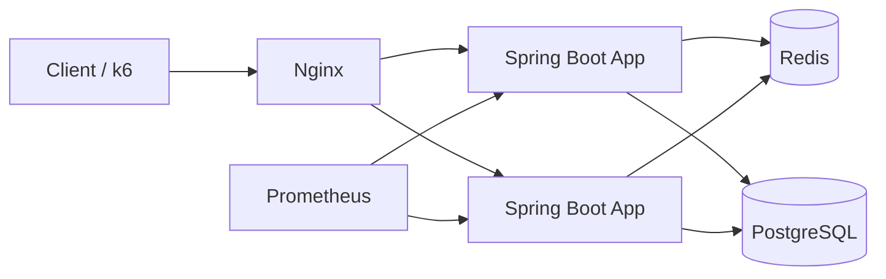

# SeatRace

SeatRace는 공연/이벤트 좌석 예약을 위한 백엔드 서버입니다.  
이벤트/좌석 조회, 좌석 홀드(HOLD), 관리자용 공연장/이벤트 관리 API를 제공합니다.

동시 요청이 몰리는 예매 환경을 가정해, 조회 병목과 Redis 장애 전파를 관찰하고
캐시, 장애 격리, 가상 대기열로 요청 흐름을 제어하는 것을 목표로 합니다.

## Architecture



## Problem, Design, Verify

### 1. Seat read pressure

- **Problem**: mixed seat-read and hold traffic concentrated reads on PostgreSQL,
  increasing HikariCP pending connections.
- **Design**: Redis seat cache is backed by a short-lived local cache so reads can
  avoid both repeated database access and unnecessary Redis dependence.
- **Verify**: under `500 RPS` seat reads and `100 RPS` holds, read p95 improved
  from `501.87ms` to `34.08ms` and HikariCP pending fell from `189` to `0`.

### 2. Redis failure isolation

- **Problem**: Redis timeouts on the read path could keep request threads waiting
  long enough to increase database-pool pressure.
- **Design**: separate Circuit Breakers and Bulkheads by business role. Seat reads
  bypass Redis through the cache fallback path, while queue and reservation writes
  fail closed because they require distributed coordination.
- **Verify**: during a `500 RPS` Redis-failure read test, p95 improved from
  `1.94s` to `16.03ms` and HikariCP pending fell from `178` to `0`.

### 3. Virtual queue admission

- **Problem**: a simultaneous reservation burst caused database-pool waits and
  seat-hold conflicts. The first queue implementation also accumulated Redis
  round trips during enter and status checks.
- **Design**: Redis ZSETs model waiting and active users. Lua scripts make queue
  state transitions atomic in one Redis round trip; queue status, entry,
  advancement, and lease renewal use isolated resilience policies. Heartbeat and
  release endpoints renew or return active capacity explicitly.
- **Verify**: in three repeated 200-user reservation bursts, queue-off HikariCP
  pending reached `95` and hold conflicts had a median of `39`. With admission at
  `40 users/s` and an active-user limit of `80`, pending remained `0` and median
  hold conflicts fell to `12` (`69.2%` reduction). The explicit tradeoff was an
  admission-wait p95 of about `33.5s` for users outside the active capacity.

Detailed experiment assumptions and commands are documented in
[Redis resilience policy](docs/redis-resilience.md) and
[virtual queue benchmark](docs/virtual-queue-benchmark.md).

## 1) 기술 스택

- Java 17
- Spring Boot 4.0.3
- Spring Web / Spring Security / Spring Data JPA / Validation
- PostgreSQL, Redis
- Flyway (DB 마이그레이션)
- JWT (Nimbus JOSE + JWT)
- Springdoc OpenAPI (Swagger UI)
- Spring Boot Actuator + Prometheus

## 2) 주요 기능

- 회원가입: `POST /api/auth/signup`
- 로그인(JWT 발급): `POST /login` (form login)
- 이벤트 목록 조회: `GET /api/events`
- 이벤트 좌석 조회: `GET /api/events/{eventId}/seats`
- 좌석 홀드: `POST /api/events/{eventId}/holds`
- 관리자 API:
  - 공연장 생성: `POST /api/admin/venues`
  - 좌석 일괄 생성: `POST /api/admin/venues/{venueId}/seats/generate`
  - 이벤트 생성: `POST /api/admin/events`

## 3) 실행 전 준비

- JDK 17
- Docker / Docker Compose

## 4) 환경 변수 설정

`.env.template`을 복사해 `.env`를 생성합니다.

```bash
cp .env.template .env
```

`.env` 예시:

```env
# Database
SPRING_DATASOURCE_URL=jdbc:postgresql://localhost:5432/seatrace
DB_NAME=seatrace
DB_PW=seatrace

# Redis
REDIS_HOST=localhost
REDIS_PORT=6379

# JWT
JWT_SECRET=change-this-to-a-secure-random-secret
```

## 5) 실행 방법

### A. Docker Compose로 전체 실행

```bash
docker compose up --build
```

앱은 `http://localhost:8080` 에서 실행됩니다.

### B. 인프라만 Docker로 띄우고 앱은 로컬 실행

1) PostgreSQL/Redis 실행

```bash
docker compose up -d postgres redis
```

2) 애플리케이션 실행

```bash
./gradlew bootRun
```

### C. Redis 장애 읽기 전용 모드

`degraded` 프로파일은 Redis 기반 대기열과 분산 락을 만들지 않습니다. Redis가
없는 상태에서도 좌석 조회의 캐시 폴백 경로를 확인할 수 있지만, 정합성 보호를 위해
대기열 진입과 예약 변경(홀드, 확정, 취소)은 `503`으로 제한합니다.

```bash
docker compose stop redis
SPRING_PROFILES_ACTIVE=degraded docker compose up -d --build --no-deps app
```

이 모드는 Redis 장애 대응을 검증하기 위한 제한 모드입니다. 일반 운영 모드에서 Redis
기반 대기열과 분산 락을 활성화한 상태라면 Redis는 필수 의존성입니다.

## 6) 테스트 실행

```bash
./gradlew test
```

## 7) 인증 방식

### 회원가입

```bash
curl -X POST http://localhost:8080/api/auth/signup \
  -H "Content-Type: application/json" \
  -d '{"email":"user1@example.com","name":"user1","password":"1234"}'
```

### 로그인 (JWT 발급)

`/login`은 form login 방식입니다.

```bash
curl -X POST http://localhost:8080/login \
  -H "Content-Type: application/x-www-form-urlencoded" \
  -d "username=admin&password=1234"
```

응답의 `accessToken`을 이후 요청에서 `Authorization: Bearer <token>`으로 사용합니다.

## 8) 기본 시드 계정

애플리케이션 시작 시 아래 계정이 없으면 자동 생성됩니다.

- USER: `user / 1234`
- ADMIN: `admin / 1234`

## 9) API 문서 및 모니터링

- 실험용 API 프론트: `http://localhost:8080/`
- 로그인: `http://localhost:8080/login.html`
- 회원가입: `http://localhost:8080/signup.html`
- 예약하기: `http://localhost:8080/reservation.html`
- Swagger UI: `http://localhost:8080/swagger-ui/index.html`
- OpenAPI JSON: `http://localhost:8080/v3/api-docs`
- Health 체크: `http://localhost:8080/health`
- Actuator Health와 Prometheus 메트릭은 관리 포트 `50000`에서 노출됩니다.
- Docker 환경에서는 `http://localhost:9090`의 Prometheus UI로 지표를 조회합니다.
- Grafana 대시보드: `http://localhost:3000` (기본 계정 `admin/admin`)
- Scouter collector: `localhost:6100` (Scouter Client에서 접속)

## 10) 프로젝트 구조

```text
src/main/java/org/example/seatrace
├── config        # 보안, OpenAPI, 앱 설정
├── controller    # REST API 엔드포인트
├── dto           # 요청/응답 DTO
├── entity        # JPA 엔티티
├── repository    # 데이터 접근 계층
├── security      # 인증/인가(JWT 필터, 사용자 principal)
└── service       # 비즈니스 로직
```

`src/main/resources/db/migration` 아래 Flyway SQL이 순서대로 적용됩니다.

## 11) 운영/개발 참고

- 좌석 홀드 TTL 기본값은 `reservation.hold.ttl-seconds=10` 입니다.
- 홀드 정리 스케줄러는 `reservation.hold.cleanup-delay-ms=3000` 주기로 동작합니다.
- 초고부하에서 DB 락 경합/커넥션 고갈을 줄이기 위해 좌석 선점(hold)과 예약 상태 변경에 Redis 분산락(Redisson)을 사용합니다.
  - 키: `lock:seat:{eventId}:{seatId}`, `lock:reservation:{reservationId}`
  - 설정: `reservation.lock.*` (`RESERVATION_LOCK_*` 환경변수로 오버라이드 가능)
- 프론트에서 로그인할 때는 `user / 1234`, `admin / 1234` 또는 가입한 계정을 사용하면 됩니다.
- `GET /api/events` 는 인증 없이 조회 가능하고, `GET /api/events/{eventId}/seats` 부터는 JWT가 필요합니다.
- `docker-compose.yml`의 `app.environment`에 `DB_URL` 키가 있으나, 애플리케이션은 `SPRING_DATASOURCE_URL`을 사용합니다.
  - 컨테이너에서 DB URL을 명시하려면 `SPRING_DATASOURCE_URL=jdbc:postgresql://postgres:5432/seatrace`를 사용하세요.

### 부하 테스트 스크립트

Prometheus/Grafana를 함께 띄운 상태에서(또는 스크립트가 자동으로 띄움) 아래 스크립트로 수치를 뽑을 수 있습니다.

```bash
# (A) 분산락 ON/OFF에 따른 Hikari 커넥션풀 압력 비교
EVENT_ID=1 SEAT_ID=1 RPS=100 DURATION=10s PROM_WINDOW=30s ./tools/run-lock-hikari-compare.sh

# (B) CQRS(조회/쓰기 부하 격리) 비교: 조회 부하 + 쓰기 버스트
EVENT_ID=1 SEAT_ID_FROM=1 SEAT_ID_TO=100 READ_RPS=500 WRITE_RPS=100 DURATION=30s WRITE_START=10s WRITE_DURATION=10s PROM_WINDOW=30s ./tools/run-cqrs-isolation-compare.sh

# (C) Redis 장애 폴백: 정상, Redis 중단+local cache warm,
#     앱 재기동으로 local cache를 비운 뒤 Redis 중단 비교
EVENT_ID=1 READ_RPS=500 DURATION=30s PROM_WINDOW=30s \
  ./tools/jmeter/run-chaos-redis-fallback.sh 2>&1 | tee tools/log/redis-fallback-$(date +%Y%m%d-%H%M%S).log
```

- (A)는 Prometheus의 `hikaricp_connections_*` 지표로 `active/pending/timeout` 피크를 비교합니다.
- (B)는 k6 요약(`CQRS Isolation Summary`)의 `read_p95`, `write_p95`, `write_ok_rate`와 함께 `seat_db_load_inc_*`(좌석 조회가 DB를 얼마나 때렸는지)까지 같이 확인합니다.
- (C)는 Redis 중단 중 `read_ok_rate`, `read_p95/p99`, DB 폴백 수, HikariCP 대기와 `redis_fallback_inc_*` 및 `redis_bypass_inc_*`를 함께 기록합니다.

### Scouter APM 프로파일링

Grafana/Prometheus는 시스템 지표와 추세를 보기 좋고, Scouter는 요청 내부의 method profile, SQL/JDBC 구간, thread 상태를 더 자세히 확인하기 좋습니다.

Scouter를 함께 실행하려면 compose override를 사용합니다.

```bash
docker compose -f docker-compose.yml -f docker-compose.scouter.yml up -d --build --scale app=2 scouter scouter-host app nginx
```

Scouter Paper는 `http://localhost:6188/extweb/index.html`에서 확인합니다. Scouter Client에서는 `localhost:6100`으로 접속합니다. 앱 컨테이너는 `JAVA_TOOL_OPTIONS`로 아래 agent를 활성화합니다.

```text
-javaagent:/opt/scouter/agent.java/scouter.agent.jar
-Duser.timezone=Asia/Seoul
--add-opens=java.base/java.lang=ALL-UNNAMED
--add-exports=java.base/sun.net=ALL-UNNAMED
-Djdk.attach.allowAttachSelf=true
-Dscouter.config=/opt/scouter/agent.java/scouter.conf
```

주요 확인 포인트:

- `/api/events/{eventId}/seats`: Redis/local cache hit 이후 DB 호출이 줄어드는지
- `/api/events/{eventId}/holds`: 분산락, Redis fast-fail, DB transaction 구간 중 어디가 p95를 만드는지
- hold 만료 cleanup: scheduler chunk 처리 중 JDBC 시간이 긴지
- Redis 장애 테스트: Redis timeout이 request thread를 오래 붙잡는지
- 결제 기능 추가 시: fake payment delay 중 DB connection을 점유하지 않는지

Mac Scouter Client 앱이 실행되지 않으면 `xattr -cr scouter.client.app`을 실행합니다. XLog 테이블 표시가 깨질 때는 `~/.scouter/xlogcolumnfile/`을 삭제한 뒤 Client를 다시 실행합니다.

Scouter agent 설정은 `scouter/agent.java/scouter.conf`에 있습니다. 기본 profile 범위는 controller/service/repository 패키지입니다. Host CPU, memory, disk, network 지표는 `scouter-host`의 Host Agent가 수집합니다.
기본 버전은 Scouter `2.20.0`이며, `SCOUTER_AGENT_VERSION`, `SCOUTER_SERVER_VERSION`으로 변경할 수 있습니다.
